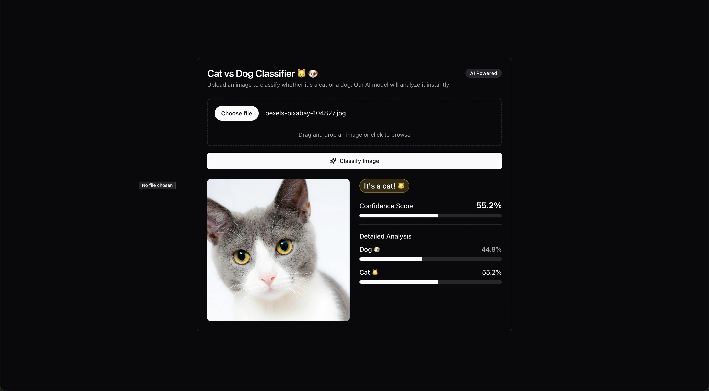

# Cat vs Dog Classifier Lambda Deployment w/ ONNX, FastAPI & FastHTML

This project deploys a FastAPI application that classifies images as either cats or dogs using a deep learning model. The application is containerized and deployed to AWS Lambda.



## Prerequisites

### AWS Setup

1. Install AWS CLI:

```bash
curl "https://awscli.amazonaws.com/awscli-exe-linux-x86_64.zip" -o "awscliv2.zip"
unzip awscliv2.zip
sudo ./aws/install
```	

1. Create an IAM User:
   - Go to AWS Console > IAM > Users > Create User
   - Create a new policy with the following permissions:

```json
{
    "Version": "2012-10-17",
    "Statement": [
        {
            "Effect": "Allow",
            "Action": [
                "cloudformation:*",
                "ecr:*",
                "ssm:*",
                "s3:*",
                "iam:*"
            ],
            "Resource": "*"
        }
    ]
}
```
   - Attach the policy to your user
   - Create access keys for the user

3. Configure AWS CLI:

```bash
aws configure
```
Enter your AWS access key ID, secret access key, default region, and output format.

### Install Node.js and CDK

1. Install Node.js (if not already installed)
2. Install AWS CDK:

```bash
npm install -g aws-cdk
```

## Project Setup

1. Install development requirements:

```bash
pip install -r requirements-dev.txt
```

2. Convert PyTorch model to ONNX:

```bash
# Place your PyTorch model (model.pt) in the project root
python export_onnx.py
```

This will create `model.onnx` in your project directory.

3. Install application requirements:

```bash
pip install -r requirements.txt
```

## Local Testing

Run the FastAPI application locally:

```bash
uvicorn app:app --reload
```

Visit http://localhost:8000 to test the application.

or use the client to test the application:

```bash
python client.py
```

## Docker Build

Build the Docker image locally:

```bash
docker build -t cat-dog-classifier .
```

Test the Docker container:

```bash
docker run -p 8000:8000 cat-dog-classifier
```

## AWS Deployment

1. Bootstrap CDK (first time only):

```bash
cdk bootstrap
```

2. Deploy the application:

```bash
cdk deploy
```

After deployment, CDK will output the Lambda function URL. You can use this URL to access your application.

## Cleanup

To remove the deployed resources:

```bash
cdk destroy
```

## Troubleshooting

1. If `cdk bootstrap` fails, verify your AWS credentials and permissions
2. If the Docker build fails, ensure all required files are in place
3. If the Lambda deployment fails, check CloudWatch logs for details

## Notes

- The Lambda function is configured with 8GB of memory and a 5-minute timeout
- The endpoint is public (no authentication required)
- The model expects images to be resized to 160x160 pixels
